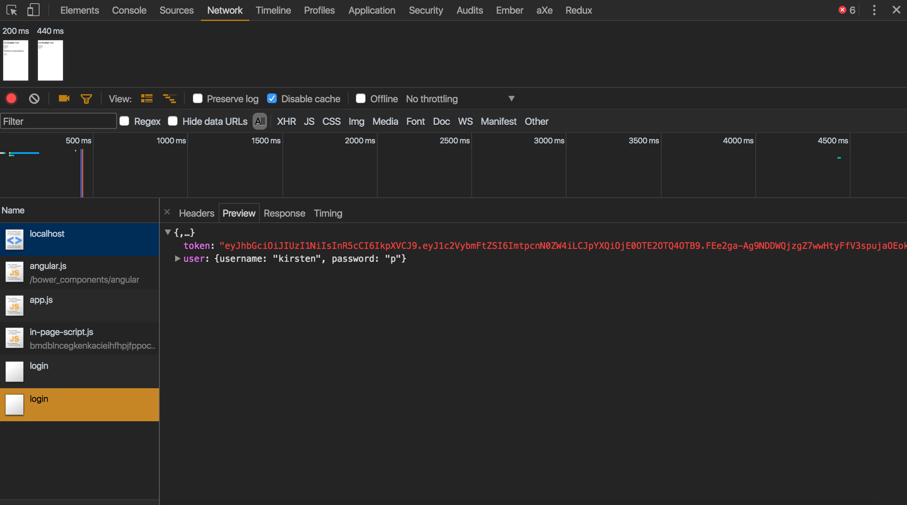

# JWT - JSON Web Tokens

[JWT](https://jwt.io/introduction/) is an encoded JSON object that is digitally signed by the server, which the client sends in order to identify the user. JWTs can be signed using a secret (HMAC algorithm) or a public/private key pair (RSA algorithm).

### This application uses two servers. One to generate random users and the other for the front-end to display the users. Because two servers are being used there will be cors (cross origin resource sharing) issues.  

*Need to `npm install cors --save`*  

## How to Start Servers

Start `http://localhost:3000/random-user` by `nodemon server.js`

Start `http://localhost:8080/` by `http-server`

*`http-server` is a command-line http server. Install by `npm install http-server -g`*

## How to Use Developer Tools to Inspect JWTs

Within the `Network` tab in the Chrome DevTools you can click on the`Headers` tab to view the request the user sent. The user sent a username and password.

Then a token is assigned with the username. This is an example of a token.

Click the `Preview` tab within the `Network` tab to view what the server returned. The server returned a signed token with a secret only the server knows about and the user information.

Click the `Response` tab within the `Network` tab to view the token and the user information that is sent to the server to verify the user.

